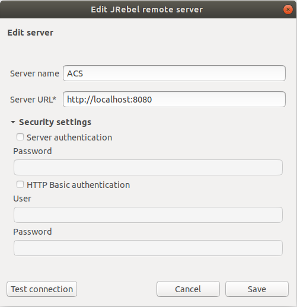
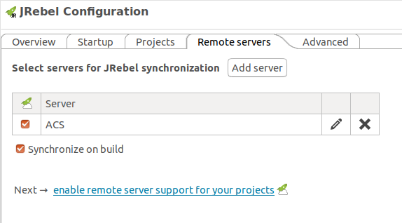
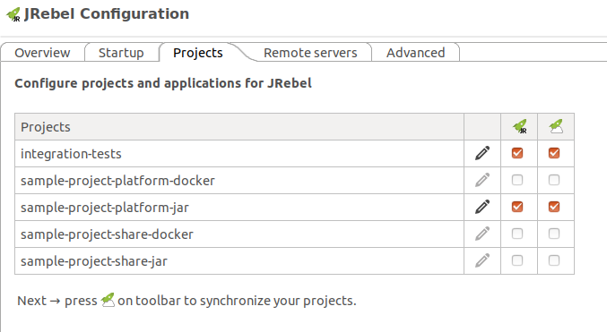

# How to configure and use JRebel

[JRebel](https://zeroturnaround.com/software/jrebel/) is the agent that enables you to do hot reloading. This allows you to modify the application code, 
and view the changes without having to restart Alfresco Tomcat (or the ACS Docker container).

A prerequisite to this tutorial is having an Alfresco project created with Alfresco SDK 4.0, using the All-In-One archetype, or the Platform JAR archetype. 
It's worth noting that hot reloading is only supported on the platform, and not in Alfresco Share.

An open source and free of charge alternative to JRebel is HotSwapAgent. For more details, see the [HotSwapAgent website](http://hotswapagent.org/index.html).

JRebel can be installed in several ways: for example, using an IDE or in "standalone" mode. Various IDEs are supported, including Eclipse and IntelliJ. The 
standalone installation is useful if you want to use hot reloading from the command line.

## Installing JRebel standalone (from the command line)

1. Download JRebel in standalone mode and unpack it in your preferred location.
2. Run the activate-gui.sh script to activate your installation.

_Note that a license is required. In this step you will be able to request a trial license._

## Installing JRebel using Eclipse IDE

1. Open Eclipse and go to `Help > Eclipse Marketplace`….
2. Search for JRebel and select Install.
3. Restart Eclipse to complete the installation.
4. Select `Help > JRebel > Activation` to activate your installation.

_Note that a license is required. In this step you will be able to request a trial license._

5. Select `Help > JRebel > Configuration > Remote servers` to add a new remote server.
6. Give a descriptive name to the new server and set the `Server URL` as `http://localhost:8080/alfresco`.



7. Select the checkbox to enable the server synchronisation and the checkbox to `Synchronize on build`.



8. Select `Help > JRebel > Configuration > Projects` and select the checkbox to enable JRebel and the remote server support for required projects (the complete 
project in case of the Platform Jar archetype or the `PROJECT_ARTIFACT_ID-platform` and `PROJECT_ARTEFACTID-integration-tests` modules in case of the All-In-One archetype).



## Installing JRebel using IntelliJ IDEA

1. Open IntelliJ and go to `Preferences > Plugins`….
2. Search for JRebel and select Install.
3. Restart IntelliJ to complete the installation.
4. Select `Preferences > JRebel > JRebel License` to activate your installation.

_Note that a license is required. In this step you will be able to request a trial license._

5. Select `Preferences > JRebel > Remote Servers` to add a new remote server.
6. Give a descriptive name to the new server and set the `Server URL` as `http://localhost:8080/alfresco.


7. Select the checkbox to enable the server synchronisation and the checkbox to `Synchronize on build`.


8. Open the JRebel Panel and select the checkbox to enable JRebel and the remote server support for required projects (the complete project in case of the 
Platform Jar archetype or the `PROJECT_ARTIFACT_ID-platform` and `PROJECT_ARTEFACTID-integration-tests` modules in case of the All-In-One archetype).


## Configuring JRebel in the project

By default, JRebel is not set up in the projects generated making use of the Alfresco SDK archetypes. So, in order to enable it, you'll need to follow the next 
steps:

1. Once JRebel is activated, copy `JREBEL_BASE_DIR/jrebel.jar` and `JREBEL_BASE_DIR/lib/libjrebel64.so` to  
`PROJECT_ARTIFACT_ID-platform-docker/src/main/docker` folder in case of the All-In-One archetype or `PROJECT_ARTIFACT_ID/src/main/docker` folder in case of the
Platform Jar archetype.
2. Modify the file `PROJECT_ARTIFACT_ID-platform-docker/src/main/docker/Dockerfile` to copy the JRebel files into the platform container:
```
# Hot reload - JRebel
COPY jrebel.jar /jrebel.jar
COPY libjrebel64.so /libjrebel64.so
```
3. Modify the file `docker/docker-compose.yml` to change the `CATALINA_OPTS` environment property to use the JRebel agent and the remote plugin. Add the 
command to avoid executing Tomcat with the Security Manager enabled (it makes the hot reloading tools to fail):
```
sample-project-acs:
    image: alfresco-content-services-sample-project:development
    build:
      dockerfile: ./Dockerfile
      context: ../../../sample-project-platform-docker/target
    environment:
      CATALINA_OPTS: "-agentlib:jdwp=transport=dt_socket,server=y,suspend=n,address=8888 -agentpath:/libjrebel64.so -Drebel.remoting_plugin=true"
    command: ["catalina.sh", "run"]
    ports:
      - "${acs.port}:8080"
      - "${acs.debug.port}:8888"
    volumes:
      - alf-acs-volume:/usr/local/tomcat/alf_data
    depends_on:
      - sample-project-postgres
```

## Reloading changes in source code

1. Rebuild and restart the whole project (`run.sh/run.bat build_start`).

You'll recognize JRebel is working when you see similar log messages:

```
2017-05-16 15:28:12 JRebel:  Starting logging to file: /home/alfresco/.jrebel/jrebel.log
2017-05-16 15:28:12 JRebel:  
2017-05-16 15:28:12 JRebel:  #############################################################
2017-05-16 15:28:12 JRebel:  
2017-05-16 15:28:12 JRebel:  JRebel Agent 7.0.8 (999999999999)
2017-05-16 15:28:12 JRebel:  (c) Copyright ZeroTurnaround AS, Estonia, Tartu.
2017-05-16 15:28:12 JRebel:  
2017-05-16 15:28:12 JRebel:  Over the last 2 days JRebel prevented
2017-05-16 15:28:12 JRebel:  at least 1 redeploys/restarts saving you about 0 hours.
2017-05-16 15:28:12 JRebel:  
2017-05-16 15:28:12 JRebel:  Licensed to XXXX XXXX (XXXX)
2017-05-16 15:28:12 JRebel:  
2017-05-16 15:28:12 JRebel:  License type: evaluation
2017-05-16 15:28:12 JRebel:  Valid from: XXX 99, 9999
2017-05-16 15:28:12 JRebel:  Valid until: XXX 99, 9999
2017-05-16 15:28:12 JRebel:  
2017-05-16 15:28:12 JRebel:  You are using an EVALUATION license.
2017-05-16 15:28:12 JRebel:  Days left until license expires: 99
2017-05-16 15:28:12 JRebel:  
2017-05-16 15:28:12 JRebel:  To extend your evaluation or purchase a license,
2017-05-16 15:28:12 JRebel:  contact sales@zeroturnaround.com.
2017-05-16 15:28:12 JRebel:  
2017-05-16 15:28:12 JRebel:  If you think this is an error, contact support@zeroturnaround.com.
2017-05-16 15:28:12 JRebel:  
2017-05-16 15:28:12 JRebel:  
2017-05-16 15:28:12 JRebel:  #############################################################
```

2. Before making any changes, let's run the sample webscript by opening your browser and typing `http://localhost:8080/alfresco/s/sample/helloworld`.

This is a sample webscript generated in every project created using SDK 4.0 and the platform artifact.


3. Locate `HelloWorldWebScript.java` in the `src/main/java/.../platformsample` folder of your project (If you are using an All-In-One project, the folder is 
located in the platform sub-project).

4. Edit it using your preferred editor and change the code so that `HelloFromJava` becomes `HelloFromMe`:

```
model.put(“fromJava”,”HelloFromMe”);
```

5. Save the file and compile the Java class (using your preferred IDE or the `mvn compile` command).

A number of log messages appear in the Alfresco project terminal, for example:

```
... JRebel: Reloading class 'com.example.platformsample.HelloWorldWebScript'.
... JRebel: Reconfiguring bean 'webscript.alfresco.tutorials.helloworld.get' 
[com.example.platformsample.HelloWorldWebScript]
```

6. Refresh the browser to see the updated message:


By changing the code and compiling it again, the changes have been dynamically received from Alfresco Content Services.
